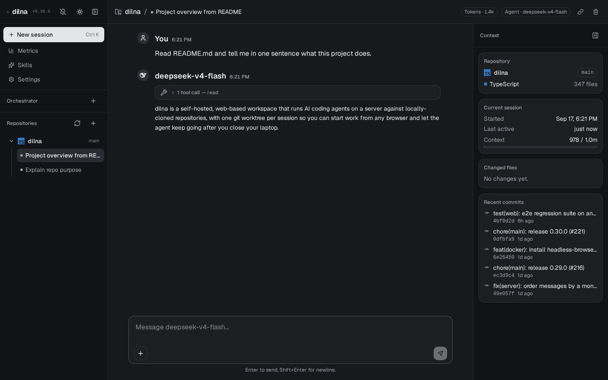
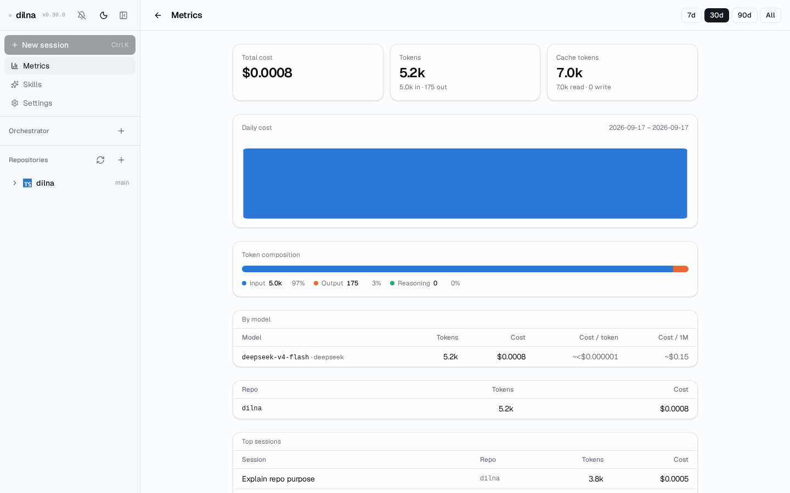

# dilna

[](https://github.com/mrmarble/dilna/actions/workflows/docker-publish.yml)
[](mise.toml)
[](https://github.com/mrmarble/dilna/tags)
[](LICENSE)

**Your coding agents, running on a server, not your laptop.**

dilna is a self-hosted, web-based workspace for running AI coding agents against locally-cloned repositories. Kick off a session from your phone, close the laptop, and the agent keeps working — because it never lived there in the first place.

> *dilna* is Czech for "workshop" — a place where the work happens whether or not you're standing in it.

> ⚠️ **Fully vibecoded.** This project is built almost entirely by AI agents (fittingly, using dilna itself). Expect rough edges, and review before running it against anything you care about.


<table>
  <tr>
    <td></td>
    <td></td>
  </tr>
  <tr>
    <td align="center"><sub>A real session — the agent reading a file and answering from it</sub></td>
    <td align="center"><sub>Metrics — token usage and cost, per model, repo, and session</sub></td>
  </tr>
</table>

## Why

Claude Code, Codex, Copilot — they're all great, until you close the laptop. A long or autonomous run means the machine has to stay open and awake. The cloud versions of those same tools fix "stay awake" by taking the code away from you instead: they edit files on someone else's servers, and even where they can run code, it isn't running on anything you control. The other option has always been SSH into a box you own — which works, but the ergonomics are bad, and worse on a phone.

dilna is the missing middle: a real chat UI, like the cloud agents, but the repo and the execution stay on hardware you control. A session survives you closing the laptop, and you can pick the exact same conversation back up from your phone — check a PR from the couch, kick off a fix from the checkout line, keep going wherever you are.

## Features

- 🖥️ **Server-side agents, your hardware** — powered by pi-ai/pi-agent-core, running real commands against a real git worktree, not just proposing diffs from someone else's sandbox
- 🌿 **One worktree per session** — every chat gets its own sandboxed git worktree, so parallel sessions mean parallel branches and zero collisions
- 📱 **Resumable, cross-device chat** — start a session on your laptop, close the lid, pick the same conversation back up from your phone
- 🔔 **Background Agents + push notifications** — sessions keep working unattended, and you get notified — even on mobile, via web push — the moment a turn finishes
- 🧭 **Orchestrator** — a global meta-chat that fans work out across repos on its own ("work on issues 79, 80, and 81 in dilna, one session each") instead of you opening every session by hand
- 🧩 **Skills** — install `SKILL.md`-style reusable procedures once, then enable them per repo
- 📊 **Metrics** — a cost and token-usage dashboard, broken down by model, repo, and session
- 🌍 **Provider-agnostic** — Anthropic, DeepSeek, Moonshot (Kimi), or Zhipu (GLM); switch models anytime from Settings, same UI throughout
- 🔒 **Self-hosted** — your repos, your data, your infra; every session sandboxed to its own worktree

## Quick start

```bash
docker compose up
```

Set `DILNA_PROVIDER` and `DILNA_MODEL` (one global choice for the whole instance — valid providers are `anthropic`, `deepseek`, `moonshotai`, `zai`) plus the matching API key (`ANTHROPIC_API_KEY`, `DEEPSEEK_API_KEY`, `MOONSHOT_API_KEY`, or `ZAI_API_KEY`) in your environment or a `.env` file. Prefer not to pin one up front? Leave them unset and pick a provider/model from the web Settings view once the container is up — it's saved to disk and survives restarts.

`docker-compose.yml` mounts your host's `~/.ssh` read-only by default, so agents can push/pull without extra setup — and you're driving them from a browser tab. If SSH auth fails inside the container, set `PUID`/`PGID` to your host user's `id -u`/`id -g`: the container runs as an unprivileged user (uid 1000 by default) that needs matching ownership to read a tightly-permissioned private key.

Set `GH_TOKEN` too if you want agents to open PRs or read/comment on issues via the `gh` CLI — generate one with `gh auth login` then `gh auth token` on a machine where you already have `gh` set up, or create a classic PAT at https://github.com/settings/tokens with `repo` scope (add `workflow` if agents need to edit workflow files, `read:org` for org-owned repos).

## Local development

```bash
mise install       # node 24.18.0, pnpm 11.10.0
cp .env.example .env   # fill in DILNA_PROVIDER/DILNA_MODEL + the matching API key
pnpm install
pnpm dev
```

mise loads `.env` automatically (see `mise.toml`'s `_.file` directive) into every command it runs in this repo, so the tokens persist across `pnpm dev`/`pnpm test` invocations without re-exporting them each session.

- `apps/server` — Hono API + the agent runtime
- `apps/web` — the chat UI
- `packages/shared` — types shared across both

See `docs/adr` for the architecture decisions behind it, and `CONTEXT.md` for the vocabulary this codebase uses (Repo, Worktree, Session, Agent).
